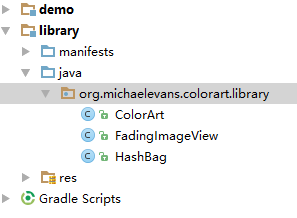

# ColorArt


## 源码地址
https://github.com/MichaelEvans/ColorArt

## 效果


这个图是这个项目里的图，并非正确，实际运行程序时候，看到的图片从左向右1/3的区域是有渐变效果的。

## 项目结构


`demo`是一个示例程序。下面主要分析library中的代码


## ColorArt类

使用方法很简单：
```java
// get a bitmap and analyze it
Bitmap bitmap = BitmapFactory.decodeResource(getResources(), R.drawable.album);
ColorArt colorArt = new ColorArt(bitmap);

// get the colors
colorArt.getBackgroundColor()
colorArt.getPrimaryColor()
colorArt.getSecondaryColor()
colorArt.getDetailColor()
```

原理：

RGB颜色用一个int就可以表示了。

首先从图像的最左边的边缘对应的那一列像素中找到出现次数最多的颜色。若改颜色偏白色或者黑色，则尽量不要，看出现次数次多的颜色是否合适。实在没合适的就用黑色。  =》见 findEdgeColor 方法。

除了背景颜色BackgroundColor，其他三个颜色（PrimaryColor、SecondaryColor、DetailColor）则是从整个图像中得到了。这些颜色之间要有足够鲜明的对比，如何判断呢：见isContrastingColor 、 isDistinctColor 这两个方法。

## HashBag类
是对HashMap的简单封装。K是颜色，V是出现次数。


## FadingImageView类

继承自ImageView，会根据参数在图像上下左右某个地方的1/3处设置一个渐变。

重载了onSizeChanged方法，根据log，即使不改变图像大小，也应该会调用一次。