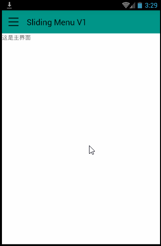
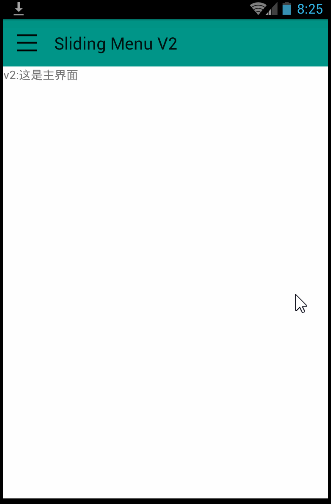
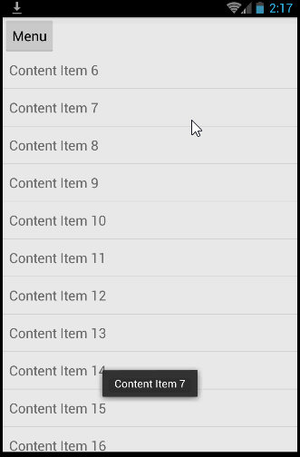

# Sliding Menu 滑动式菜单

思路1：一个layout里包含两个子layout（左和右），修改某个子layout的某侧的margin即可。 V1~V3都是这样做的。

思路2：弹出一个没有占据整个屏幕的activity。类似http://blog.csdn.net/lmj623565791/article/details/23116115 。

思路3：使用SlidingPaneLayout，见 http://www.lai18.com/content/1849726.html 

思路4：SlidingMenu https://github.com/jfeinstein10/SlidingMenu

## SlidingMenuV1

参考 http://my.oschina.net/helu/blog/143296

## SlidingMenuV2

参考 http://my.oschina.net/helu/blog/143296

使用了AsyncTask产生滑动效果。

## SlidingMenuV3

源码阅读。和V2类似。

代码来自 http://blog.csdn.net/guolin_blog/article/details/8744400 。改成了android studio项目。代码有小的改动。

http://blog.csdn.net/guolin_blog/article/details/9671609 给出了左中右三个布局的示例，左和右布局展现不同的menu。

## SlidingMenuDemos 源码阅读
SlidingMenu源码阅读

进行中。。。。

源码： https://github.com/jfeinstein10/SlidingMenu

