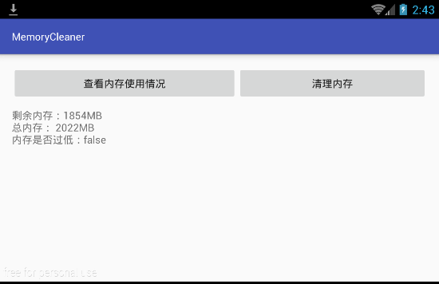

# 内存清理程序





## 获取内存使用情况

**方式1：**
```
MemoryInfo mi = new MemoryInfo();
ActivityManager activityManager = (ActivityManager) getSystemService(ACTIVITY_SERVICE);
activityManager.getMemoryInfo(mi);
long availableMegs = mi.availMem / 1048576L;

//Percentage can be calculated for API 16+
long percentAvail = mi.availMem / mi.totalMem;  // totalMem是 API16+才存在
```

**方式2：**

```
$ cat /proc/meminfo
```

写个程序分析文件`/proc/meminfo`即可。

