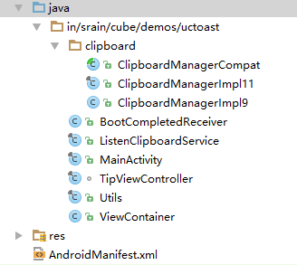

# UCToast源码阅读

## 源码地址 
https://github.com/liaohuqiu/android-UCToast

## 相关博客
[Android无需权限显示悬浮窗, 兼谈逆向分析app](http://www.jianshu.com/p/167fd5f47d5c)

[Android 悬浮窗的小结](http://www.liaohuqiu.net/cn/posts/android-windows-manager/)

## 效果

## 源码结构

## 设计与实现

基本思路是后台启动一个service，当检测到剪切板有变化时，显示悬浮窗。点击悬浮窗后会在MainActivity中显示复制的内容。

### MainActivity

启动MainActivity时会启动service ListenClipboardService。无论是否关闭MainActivity，当检测到剪切板有变化时，显示悬浮窗。点击悬浮窗后会在MainActivity中显示复制的内容。

### 开机启动Service
`BootCompletedReceiver`会在开机时启动Service，与MainActivity中启动service的形式不同，使用了wake lock。见ListenClipboardService类下的startForWeakLock函数。

关于wake lock：[保持设备为唤醒状态](http://zlv.me/posts/2015/06/09/12_keep-device-awake/)

### 如何监听剪切板变化
ClipboardManagerCompat是基类，由于Android版本不同，API有所不同，具体使用的是ClipboardManagerImpl11类或者ClipboardManagerImpl9类。ClipboardManagerCompat是这两个具体实现类的父类。在具体实现类中都重载了addPrimaryClipChangedListener方法和removePrimaryClipChangedListener方法，这两个方法默认用于添加`监听器`。但在重载后会额外添加/删除`监听剪切板`的功能。

在ListenClipboardService类的onCreate方法中，调用了addPrimaryClipChangedListener方法，这意味着创建service时候会开始监听剪切板变化，如果有变化则会触发`监听器`中的指定方法。注意，若service已经启动，再次start它并不会再次触发onCreate。

### 布局文件
MainActivity使用的activity_main.xml和content_main.xml，悬浮窗使用的pop_view.xml。