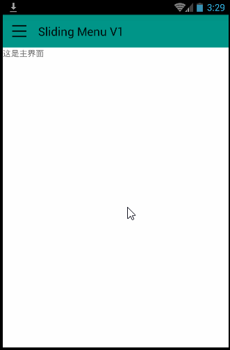
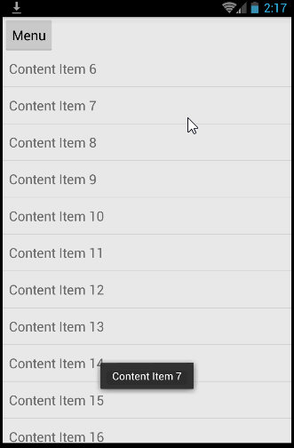

# Sliding Menu 滑动式菜单

思路1：一个layout里包含两个子layout（左和右），修改某个子layout的某侧的margin即可。 V1~V3都是这样做的。

思路2：弹出一个没有占据整个屏幕的activity。类似http://blog.csdn.net/lmj623565791/article/details/23116115 。

## V1

参考 http://my.oschina.net/helu/blog/143296

## V2

参考 http://my.oschina.net/helu/blog/143296

使用了AsyncTask产生滑动效果。

## V3

源码阅读。

代码来自 http://blog.csdn.net/guolin_blog/article/details/8744400 。改成了android studio项目。代码有小的改动。